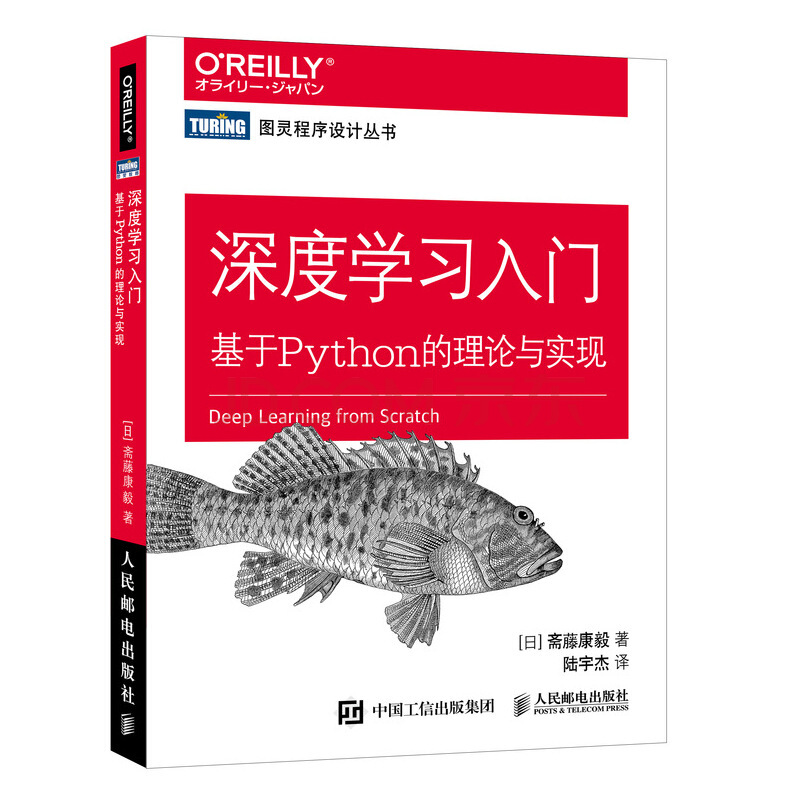

# 《Deep Learning With Python》Reading Notes
# 《深度学习入门 基于Python的理论与实现》

# 1. 书籍配套代码地址：
<https://github.com/oreilly-japan/deep-learning-from-scratch.git>

# 2. 代码运行环境问题
<https://blog.csdn.net/u010512264/article/details/118768624>

# 3. 笔记
# [第1章-Python入门](./notes/第1章-Python入门.md)
# [第2章-感知机](./notes/第2章-感知机.md)
# [第3章-神经网络](./notes/第3章-神经网络.md)
# [第4章-神经网络的学习](./notes/第4章-神经网络的学习.md)
# [第5章-误差反向传播法](./notes/第5章-误差反向传播法.md)
# [第6章-与学习相关的技巧](./notes/第6章-与学习相关的技巧.md)
# [第7章-卷积神经网络](./notes/第7章-卷积神经网络.md)
# [第8章-深度学习](./notes/第8章-深度学习.md)

  