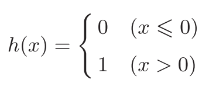

# 第3章 神经网络
* 神经网络的一个重要性质是它可以自动地从数据中学习到合适的权重参数。

## 3.1 从感知机到神经网络
### 3.1.1 神经网络的例子
* 输入层、输出层、中间层（隐藏层）
### 3.1.2 复习感知机

### 3.1.3 激活函数登场
* 激活函数：将输入信号的总和转换为输出信号。
* 激活函数是连接感知机和神经网络的桥梁。

## 3.2 激活函数
* 阶跃函数：激活函数以阈值为界，一旦输入超过阈值，就切换输出。
### 3.2.1 sigmoid函数
* sigmoid: S形; s形; 乙状结肠; S形的;


### 3.2.2 阶跃函数的实现
```python
def step_function(x):
    if x > 0:
        return 1
    else:
        return 0
```

```python
import numpy as np

def step_function(x):
    '''
    支持NumPy数组的实现
    '''
    y = x > 0
    return y.astype(np.int)
```

### 3.2.3 阶跃函数的图形

*阶跃函数公式*  

```python
import numpy as np
import matplotlib.pylab as plt


def step_function(x):
    return np.array(x > 0, dtype=int)

x = np.arange(-5.0, 5.0, 0.1)
y = step_function(x)
plt.plot(x, y)
plt.ylim(-0.1, 1.1)  # 指定y轴的范围
plt.show()
```

*图3-6 阶跃函数的图形*  


### 3.2.4 sigmoid函数的实现

```python
import numpy as np

def sigmoid(x):
    return 1 / (1 + np.exp(-x))
```

### 3.2.5 sigmoid函数和阶跃函数的比较

```python
import numpy as np
import matplotlib.pylab as plt
 
def sigmoid(x):
    return 1 / (1 + np.exp(-x))


x = np.arange(-5.0, 5.0, 0.1)
y2 = sigmoid(x)
plt.plot(x, y2)
plt.ylim(-0.1, 1.1)  # 指定y轴的范围
plt.show()
```
*图3-7 sigmoid函数的图形*  

*图3-8 阶跃函数和sigmoid函数的图形*  

* 阶跃函数和sigmoid函数共同性质：
    * 输入小时，输出接近0，随着输入增大，输出向1靠近。
    * 输出信号在0到1之间。
    
### 3.2.6 非线性函数
* 神经网络的激活函数必须是非线性函数。

### 3.2.7 ReLU（Rectified Linear Unit）函数


## 3.3 多维数组的运算

### 3.3.1 多维数组
### 3.3.2 矩阵乘法
### 3.3.3 神经网络的内积

## 3.4 三层网络的实现
### 3.4.1 符号确认
### 3.4.2 各层间信号传递的实现
### 3.4.3 代码实现小结